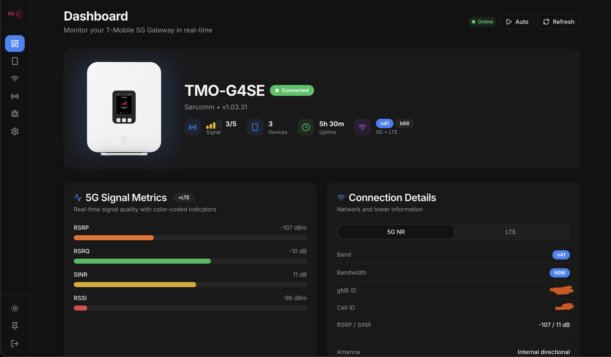
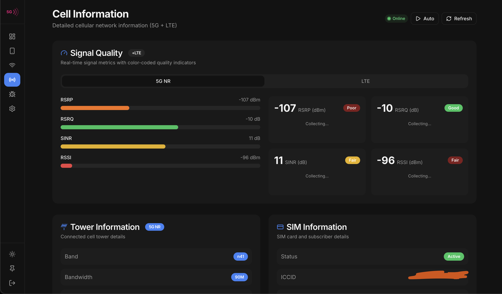
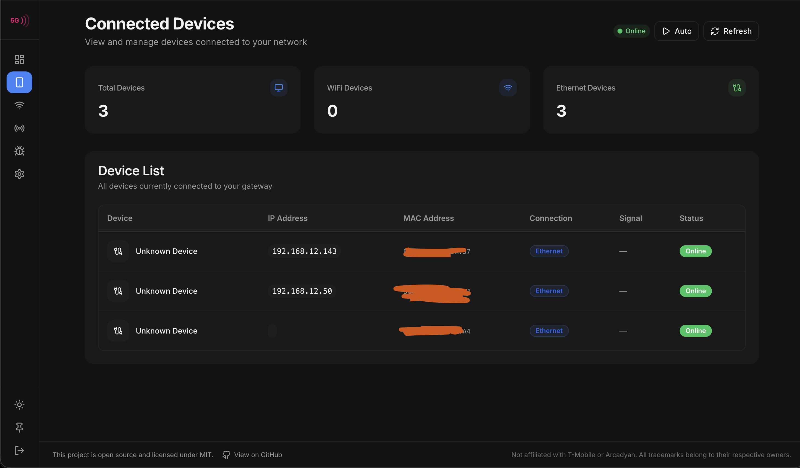
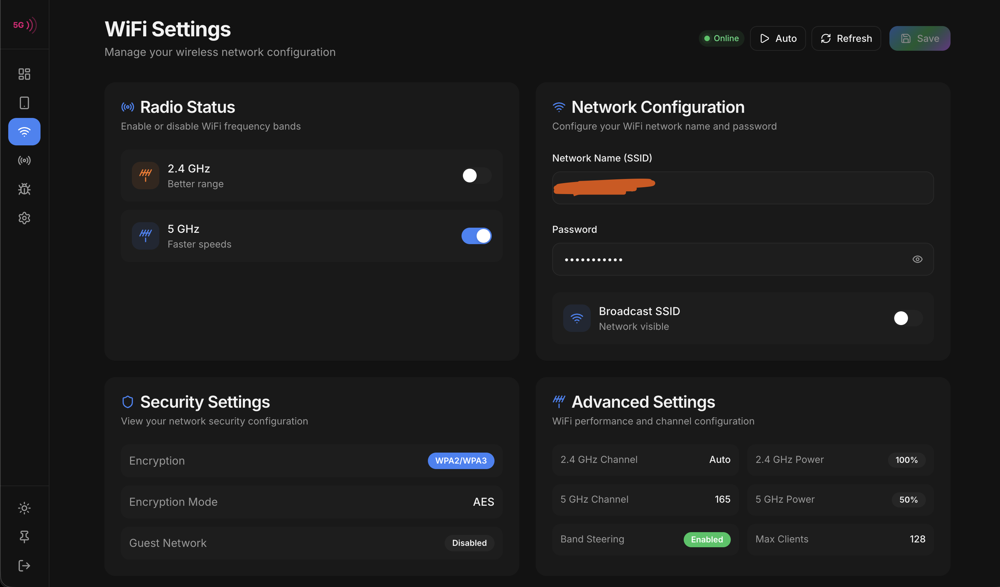
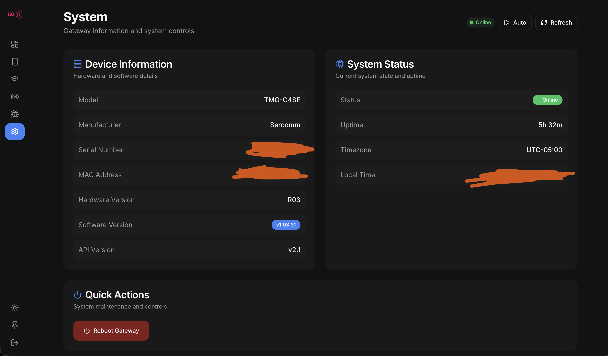

# TMO-G5AR Portal

A modern web admin interface for T-Mobile 5G Gateways (Arcadyan, Sercomm, Nokia), built with Next.js and shadcn/ui.

[](https://github.com/rchen14b/TMO-G5AR-Portal)
[](https://buymeacoffee.com/rchen14b)

## Screenshots

### Dashboard
Real-time gateway status with 5G signal metrics, connection details, and device overview.



### Cell Information
Detailed 5G cellular metrics with signal quality sparklines, tower information, and SIM details.



### Connected Devices
View all devices connected to your network with IP/MAC addresses and signal strength.



### WiFi Settings
Manage your wireless networks across 2.4GHz, 5GHz, and 6GHz bands.



### System
Gateway information, system status, and quick actions like reboot.



## Features

- **Dashboard** - Real-time signal strength gauges (RSRP/RSRQ/SINR), carrier aggregation display, connection status, uptime
- **Connected Devices** - View all clients with names, IPs, MAC addresses, and signal strength
- **WiFi Settings** - Manage SSID, password, and band configurations (2.4GHz, 5GHz, 6GHz)
- **Cell Info** - Detailed 5G metrics including tower ID, band info (n41/n71), and GPS coordinates
- **SIM Info** - ICCID, IMEI, IMSI details
- **System Controls** - Reboot gateway, view device info and firmware version
- **Responsive Design** - Works on desktop, tablet, and mobile

## Tech Stack

- **Framework**: Next.js 15 (App Router)
- **Runtime**: Bun (recommended) or Node.js
- **UI Components**: shadcn/ui
- **Styling**: Tailwind CSS
- **Charts**: Recharts
- **Data Fetching**: SWR for real-time updates
- **Icons**: Lucide React

---

## Quick Start

### Prerequisites

- [Bun](https://bun.sh/) (recommended) or [Node.js](https://nodejs.org/) 18+
- Access to your T-Mobile 5G Gateway (default IP: `192.168.12.1`)

### Installation

```bash
# Clone the repository
git clone https://github.com/rchen14b/TMO-G5AR-Portal.git
cd TMO-G5AR-Portal

# Install dependencies (choose one)
bun install     # Recommended
npm install     # Alternative
```

### Development

```bash
# Start development server (choose one)
bun dev         # Recommended - runs on http://localhost:3000
npm run dev     # Alternative

# With custom port
bun dev -- -p 8080
npm run dev -- -p 8080
```

Open [http://localhost:3000](http://localhost:3000) and login with your gateway credentials (found on the label of your device).

- **Default Username**: `admin`
- **Default Gateway IP**: `192.168.12.1`

---

## Production Build

### Build

```bash
# Build for production (choose one)
bun run build
npm run build
```

### Run Production Server

```bash
# Option 1: Using Next.js start (port 3000)
bun run start
npm run start

# Option 2: Using standalone build (recommended for deployment)
node .next/standalone/server.js
```

### Custom Port

You can change the production port using environment variables:

```bash
# Set port via environment variable
PORT=9205 node .next/standalone/server.js

# Or modify next.config.js for default port
```

### Production with PM2

For long-running production deployments:

```bash
# Install PM2 globally
npm install -g pm2

# Start with PM2
pm2 start ecosystem.config.js

# Or manually
pm2 start node --name "gx-portal" -- .next/standalone/server.js

# View logs
pm2 logs gx-portal

# Restart
pm2 restart gx-portal
```

---

## Docker

### Build Image

```bash
docker build -t g5ar-portal .
```

### Run Container

**Linux** (uses host networking for gateway access):
```bash
docker run --network host g5ar-portal
```

**macOS/Windows** (port mapping):
```bash
docker run -p 3000:3000 g5ar-portal

# Custom port
docker run -p 9205:3000 g5ar-portal
```

Access the portal at [http://localhost:3000](http://localhost:3000).

### Docker Compose

Create `docker-compose.yml`:

**Linux:**
```yaml
version: '3.8'
services:
  g5ar-portal:
    build: .
    network_mode: host
    restart: unless-stopped
```

**macOS/Windows:**
```yaml
version: '3.8'
services:
  g5ar-portal:
    build: .
    ports:
      - "3000:3000"
    restart: unless-stopped
```

Run:
```bash
docker-compose up -d
```

---

## Configuration

### Environment Variables

| Variable | Default | Description |
|----------|---------|-------------|
| `PORT` | `3000` | Server port |
| `HOSTNAME` | `0.0.0.0` | Server hostname/binding |

### Gateway Settings

The default gateway IP (`192.168.12.1`) can be changed on the login page. The portal stores your settings in browser localStorage.

---

## Router API Endpoints

These are the T-Mobile gateway API endpoints used by this portal:

| Endpoint | Auth | Description |
|----------|------|-------------|
| `POST /TMI/v1/auth/login` | No | Authenticate, returns JWT token |
| `GET /TMI/v1/version` | No | API version |
| `GET /TMI/v1/gateway?get=all` | No | Device info, signal summary, uptime |
| `GET /TMI/v1/gateway?get=signal` | No | Signal info only |
| `GET /TMI/v1/network/telemetry?get=cell` | Yes | 5G signal metrics |
| `GET /TMI/v1/network/telemetry?get=clients` | Yes | Connected devices |
| `GET /TMI/v1/network/telemetry?get=sim` | Yes | SIM card info |
| `GET /TMI/v1/network/configuration/v2?get=ap` | Yes | WiFi AP settings |
| `POST /TMI/v1/network/configuration/v2?set=ap` | Yes | Update WiFi settings |
| `POST /TMI/v1/gateway/reset?set=reboot` | Yes | Reboot gateway |

---

## Project Structure

```
src/
├── app/
│   ├── api/router/       # API routes (proxy to gateway)
│   │   ├── gateway/      # Device info & signal
│   │   ├── cell/         # 5G metrics
│   │   ├── clients/      # Connected devices
│   │   ├── wifi/         # WiFi settings
│   │   └── ...
│   ├── (dashboard)/      # Protected dashboard routes
│   │   ├── page.tsx      # Main dashboard
│   │   ├── devices/      # Connected devices
│   │   ├── wifi/         # WiFi settings
│   │   ├── cell/         # Cell info
│   │   └── system/       # System controls
│   └── login/            # Login page
├── components/
│   ├── ui/               # shadcn/ui components
│   ├── signal-gauge.tsx  # Signal visualization
│   └── ...
├── lib/
│   ├── router-api.ts     # Server-side API client
│   ├── client-auth.ts    # Client-side auth helpers
│   └── utils.ts          # Utility functions
└── hooks/
    └── use-router-data.ts # SWR hooks for data fetching
```

---

## Troubleshooting

### Cannot connect to gateway

1. Ensure you're on the same network as the gateway
2. Verify the gateway IP (default: `192.168.12.1`)
3. Try accessing `http://192.168.12.1` directly in your browser

### Login fails

1. Check that username is `admin`
2. Password is on the label of your gateway device
3. Clear browser cache/localStorage and try again

### White screen / App not loading

1. Clear `.next` folder and rebuild: `rm -rf .next && bun run build`
2. Check browser console for errors
3. Ensure all dependencies are installed: `bun install`

### Port already in use

```bash
# Find process using the port
lsof -i :3000
netstat -ano | findstr :3000  # Windows

# Kill the process or use a different port
bun dev -- -p 3001
```

---

## Development

### Adding a New Page

1. Create file in `src/app/(dashboard)/newpage/page.tsx`
2. Add navigation link in `src/components/sidebar.tsx`
3. Use existing hooks from `src/hooks/use-router-data.ts`

### Adding a New API Endpoint

1. Add function to `src/lib/router-api.ts`
2. Create route in `src/app/api/router/[endpoint]/route.ts`
3. Add SWR hook in `src/hooks/use-router-data.ts`

See `CLAUDE.md` for detailed development instructions.

---

## License

MIT

---

## Credits

- GitHub: [@rchen14b](https://github.com/rchen14b/TMO-G5AR-Portal)
- Support: [Buy Me a Coffee](https://buymeacoffee.com/rchen14b)
